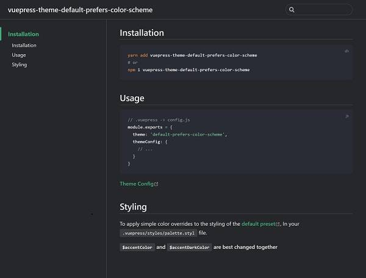

# vuepress-theme-default-prefers-color-scheme

> add prefers-color-scheme for vuepress default theme

**This theme for Vuepress 1.x, Works only on supported operating systems and browsers**

[prefers-color-scheme](https://developer.mozilla.org/en-US/docs/Web/CSS/@media/prefers-color-scheme)

[Live Demo and Documentation](https://tolking.github.io/vuepress-theme-default-prefers-color-scheme)

---




---

## Installation

``` sh
yarn add vuepress-theme-default-prefers-color-scheme
# or
npm i vuepress-theme-default-prefers-color-scheme
```

## Usage

``` js
// .vuepress -> config.js
module.exports = {
  theme: 'default-prefers-color-scheme',
  themeConfig: {
    // ...
  }
}
```

[Theme Config](https://v1.vuepress.vuejs.org/theme/default-theme-config.html)

## Styling

To apply simple color overrides to the styling of the [default preset](https://github.com/tolking/vuepress-theme-default-prefers-color-scheme/blob/master/styles/palette.styl), In your `.vuepress/styles/palette.styl` file.

**`$accentColor` and `$accentDarkColor` are best changed together**

## License

[MIT](http://opensource.org/licenses/MIT)

## Keywords

vue vuepress documentation prefers-color-scheme default-theme light-theme dark-theme
